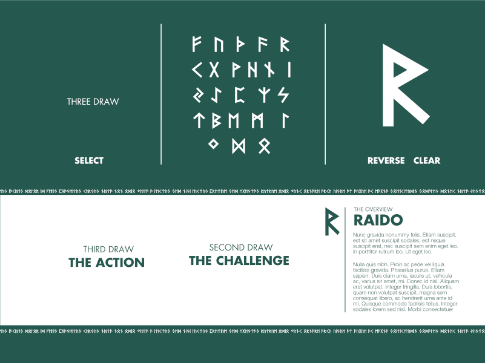
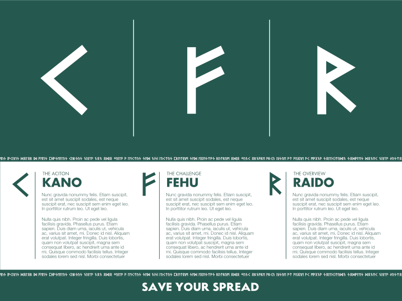
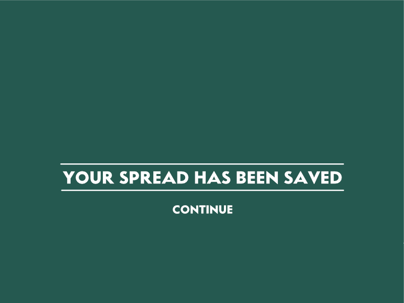
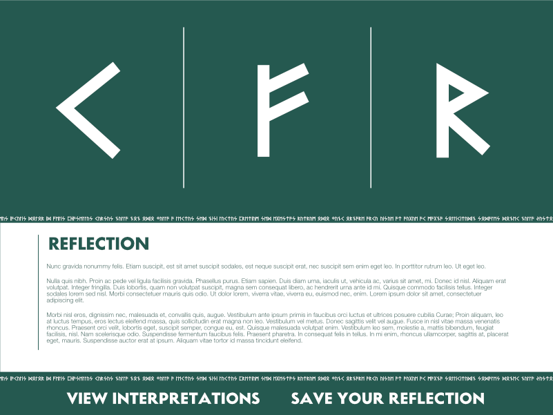
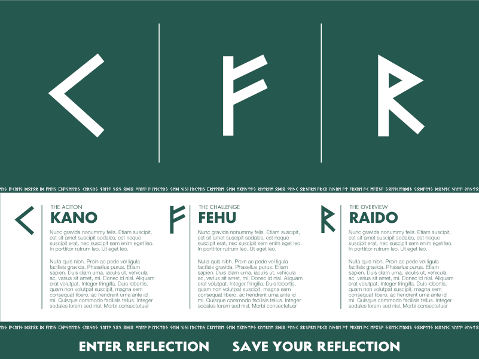
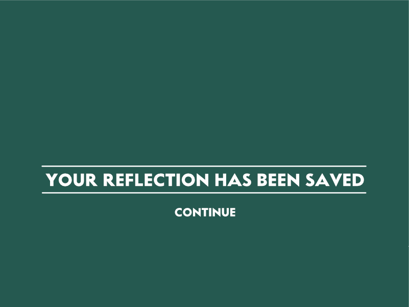

# RUNE LOG

This is app is intended to help new rune users learn the practice with a simple spread recording function coupled with a daily reflection journal. To use, simply fork and run npm install. Spreads are retained in an SQLite3 database. 

Source: The Book of Runes. Ralph H. Blum. 1993

# BEWARE

This is also Learning Code to help me learn Sass and Responsive Design. As such it is, and will most likely stay a Work In Progress in various stages of completion for the duration of it's life. 

# FUTURE?

This app could be swapped over to other forms of divination systems, I hope to add a Tarot option in the future!

# PAGE DESIGN
## Spread Handling

## Journal Handling

